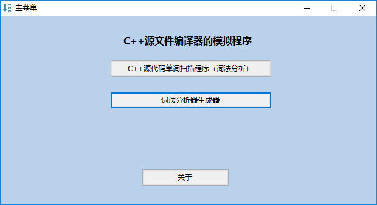
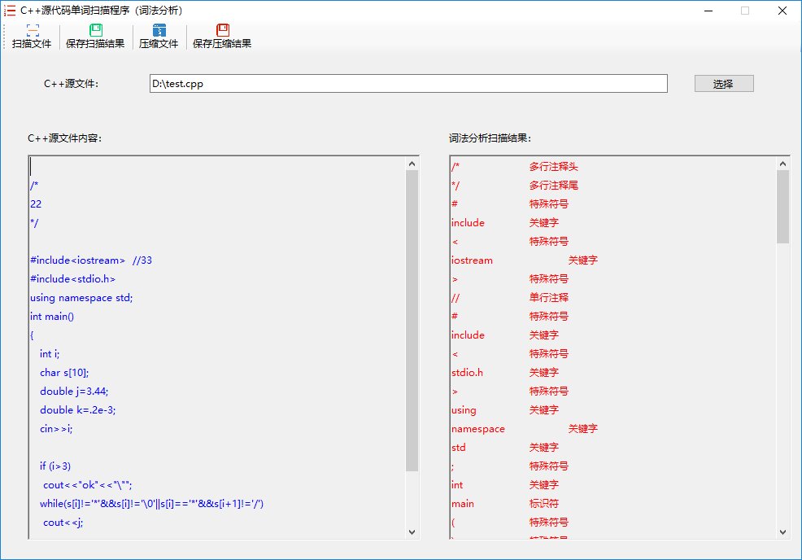
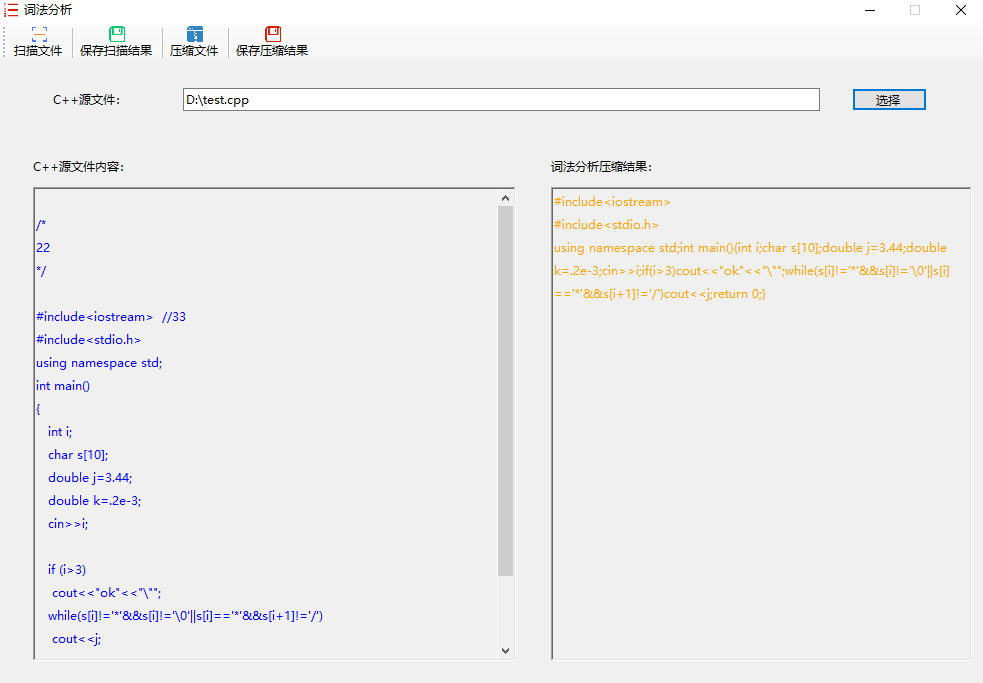
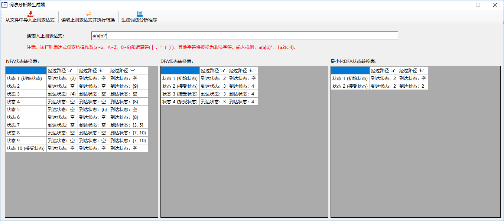
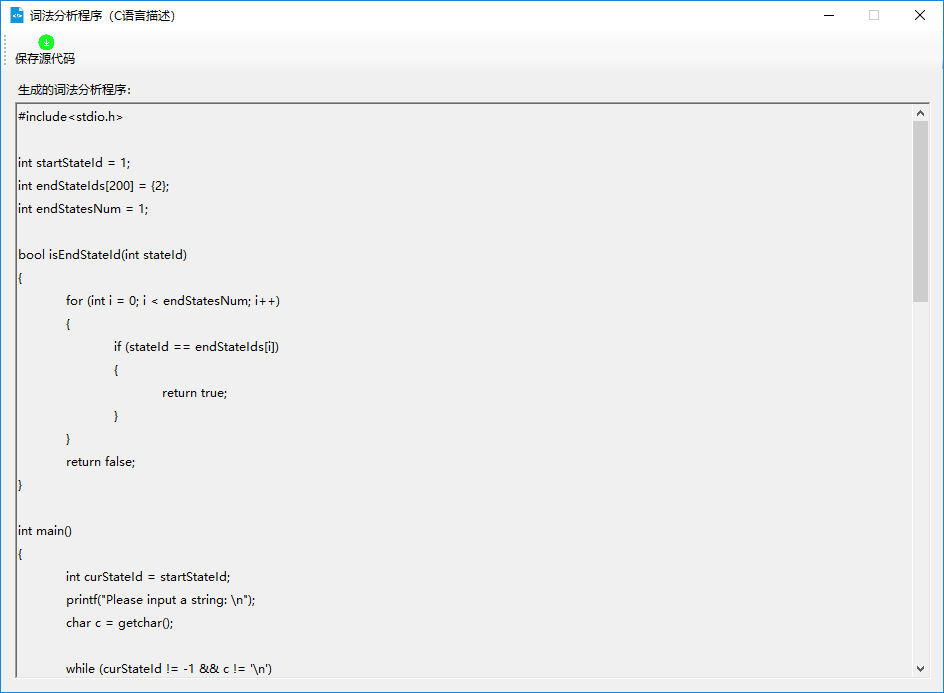
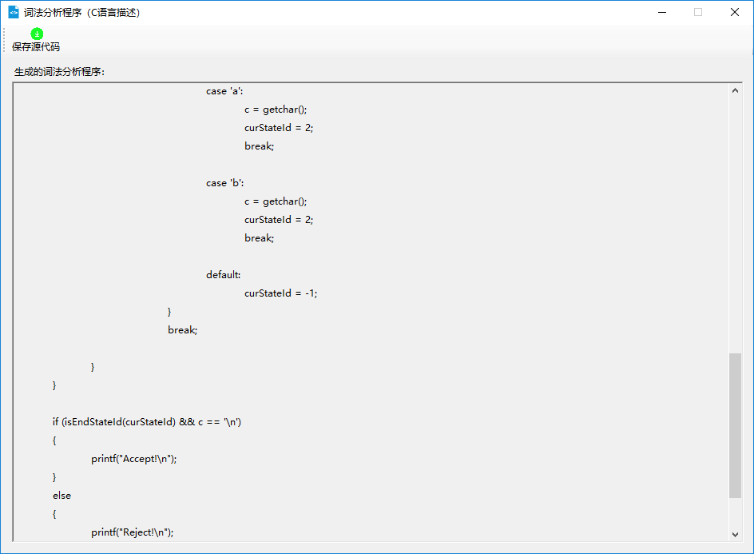
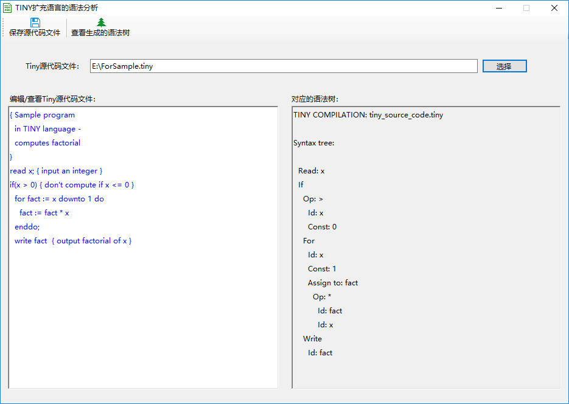
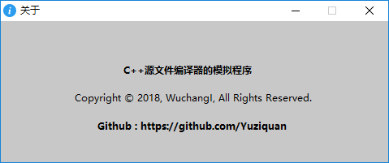

## CppCompiler

[](https://github.com/Yuziquan/CppCompiler)
[](https://github.com/Yuziquan/CppCompiler/blob/master/LICENSE)

### 一、项目功能

一个模拟C++编译器(仅支持对.cpp源文件的编译)重要工作流程的C#应用程序。


***

### 二、项目运行效果

#### 1. 主菜单



***

#### 2. 词法分析界面



<br/>
<br/>




***
#### 3. 词法分析器生成器界面（类似flex的功能）



<br/>
<br/>



<br/>
<br/>



***
#### 4. TINY扩充语言的语法分析



***
#### 5. xxx

。。。。。。。(后期要开发的菜单项)


***

#### 6. 关于




***

### 三、版本迭代&说明

#### 1、V1.0.0

* 完成模拟C++编译源程序时的词法分析功能；

***

#### 2、V1.0.1

* 改善了压缩过程，使得压缩后得到的cpp文件可以直接被编译执行；

***

#### 3、V1.0.2

* 修复了关于扫描多行注释时崩溃的bug；
* 修复了某些注释没有被正常压缩掉的bug；

***

#### 4、V2.0.0
* 完成词法分析器生成器模块(正则表达式若超过一定长度，会崩溃，有bug，下一个子版本会修复)；

***

#### 5、V3.0.0

* 完成TINY扩充语言的语法分析模块；

* 将”TINY扩充语言的语法树的生成过程“抽象出一个函数接口`getSyntaxTree`，并打包成一个dll文件，如果其他工程需要使用到“TINY扩充语言的语法树的生成”，则可以直接导入该dll文件并引用函数接口`getSyntaxTree`即可。具体细节如下：

  * 封装该dll文件的项目名为 [TinySyntaxAnalysis](https://github.com/Yuziquan/CppCompiler/tree/master/TINY%E6%89%A9%E5%85%85%E8%AF%AD%E8%A8%80%E7%9A%84%E8%AF%AD%E6%B3%95%E6%A0%91%E7%94%9F%E6%88%90%EF%BC%88DLL%E9%A1%B9%E7%9B%AE%EF%BC%89/DLL%E9%A1%B9%E7%9B%AE/TinySyntaxAnalysis) ；

  * 函数接口如下(位于[main.c](https://github.com/Yuziquan/CppCompiler/blob/master/TINY%E6%89%A9%E5%85%85%E8%AF%AD%E8%A8%80%E7%9A%84%E8%AF%AD%E6%B3%95%E6%A0%91%E7%94%9F%E6%88%90%EF%BC%88DLL%E9%A1%B9%E7%9B%AE%EF%BC%89/DLL%E9%A1%B9%E7%9B%AE/TinySyntaxAnalysis/TinySyntaxAnalysis/main.c)文件)：

    ```c
    /*
      读入全路径为sourceFileFullName的源代码文件，将扫描得到的语法树打印到全路径为savedFileFullName的文件中
    */
    extern __declspec(dllexport) void getSyntaxTree(char* sourceFileFullName, char* savedFileFullName);
    ```

  * 该项目生成的dll文件的所在位置：[TinySyntaxAnalysis.dll](https://github.com/Yuziquan/CppCompiler/blob/master/TINY%E6%89%A9%E5%85%85%E8%AF%AD%E8%A8%80%E7%9A%84%E8%AF%AD%E6%B3%95%E6%A0%91%E7%94%9F%E6%88%90%EF%BC%88DLL%E9%A1%B9%E7%9B%AE%EF%BC%89/DLL%E9%A1%B9%E7%9B%AE/TinySyntaxAnalysis/x64/Debug/TinySyntaxAnalysis.dll)；

  * 项目[CppCompiler](https://github.com/Yuziquan/CppCompiler)使用该dll文件时，放置该dll文件的位置：[TinySyntaxAnalysis.dll](https://github.com/Yuziquan/CppCompiler/blob/master/CppCompiler/CppCompiler/bin/Debug/TinySyntaxAnalysis.dll)


***

### 四、当前版本

**V3.0.0**

***

### 五、其他资料

#### 1、玩转flex
> 想简单体验一下词法分析器生成器的朋友，可以使用flex~
* flex下载地址：http://flex.sourceforge.net/
* flex 的Github主页地址：https://github.com/westes/flex
* 相关教程（自己看过，觉得不错的教程~）：
  * https://blog.csdn.net/pfl_327/article/details/83040263
  * https://blog.csdn.net/pfl_327/article/details/83148604
  * https://blog.csdn.net/wlym123/article/details/54426422
  * https://blog.csdn.net/pfl_327/article/details/83148040
  * https://blog.csdn.net/pfl_327/article/details/83216453
  * https://blog.csdn.net/kongxiaoming2333/article/details/24040031